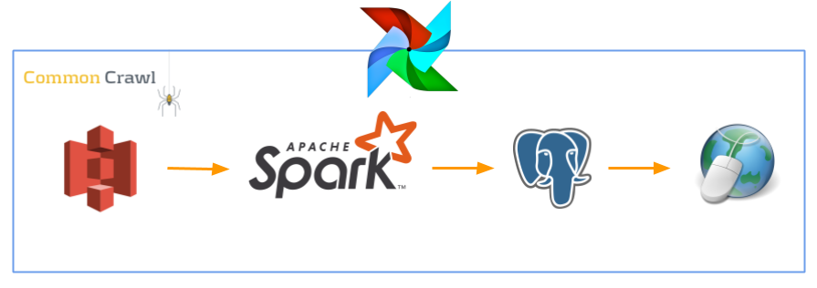

# LinkRun
**A pipeline to analyze popularity of domains across the web.**

[LinkRun web application](http://www.LinkRun.me)  
[Project slides](http://bit.ly/linkrunslides)

## Idea

LinkRun is a data engineering project that ranks the popularity of millions of websites. LinkRun was created within 3 weeks by me during the Insight Data Engineering fellowship.

LinkRun processes data from over 2.6 billion web pages (>17 terabytes compressed data) and analyzes all the links present on those pages. LinkRun then counts how many times each domain was linked, filters out links based on specific criteria, and stores these results to a database (>47 million rows). The resulting database can be queried to obtain insight about the populatiry of millions of website across the internet. A custom web application allows users to view and query the data by entering their favorite websites into a search box.

**The LinkRun database contains data for over 47 million unique subomain.domain entries from over 25 million unique websites**.

Example output:

| Domain | Number of linking pages |
|:-------:|:-------:|
| facebook.com  | 1,123,535,234     |
| youtube.com | 478,735,963     |
| ... | ...     |
| yoursite.com| 208,666      |

## The Pipeline

 

## The Data

LinkRun uses data from the [Common Crawl database](https://commoncrawl.org/). Common Crawl data is updated each month with new web crawl data. **LinkRun has analyzed the July 2019 Common Crawl data set which contains >2.5 billion web pages and >17 terabytes of compressed data.**

## How to run LinkRun on your own

LinkRun can run on any resource that supports the applications used in the pipline. For best results, LinkRun can be run on the following AWS provisioned resources: 
* AWS Elastic MapReduce (EMR) release 5.26.0, running Spark 2.4.3
  * Bootstrap the cluster using the files `linkrun_emr_bootstrap.sh` and `sample_secrets/sample_secret_bootstrap.sh` (update this file with your configurations).
* AWS RDS running Postgres 10.6
* (Optional) EC2 instance with the Dash web UI
  * To configure the connection between the web UI and the database run `sample_secrets/sample_webapp_secrets.sh` then `source ~/.bashrc`

To run the LinkRun pipeline use `run.sh`. To modify which data is processed by LinkRun modify the `src/automation/config.json` file.

## Thank you for visiting LinkRun!
